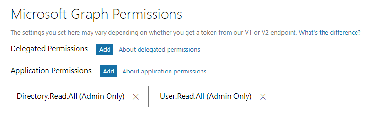
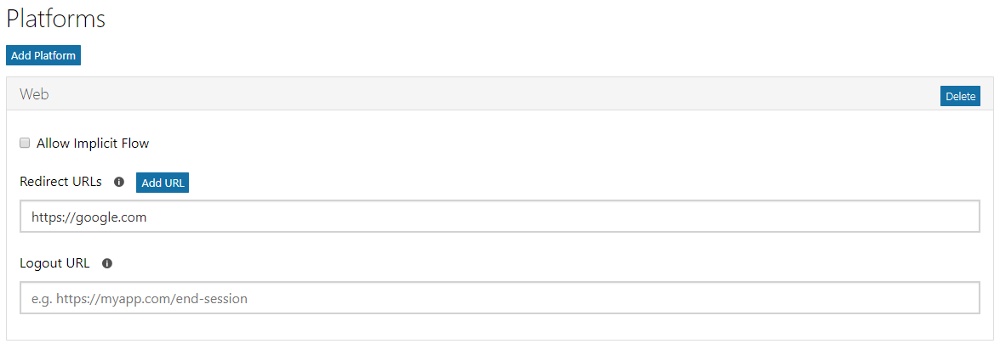

# How to complete Microsoft AD OAuth v2 authentication with a Node.js API

This repository is quickstart on integrating AD OAuth v2 authentication flow, utilising REST interface, to access information stored in the Microsoft Graph. This sample uses the App-only auth flow where there is no need for a user to be involved in the flow. This is great for APIs, background workers, etc.

## Pre-requisites 
* [Node.js](https://nodejs.org/en/) is required to run the app and to install dependencies.
* [Office 365 Developer Account](https://developer.microsoft.com/en-us/office/dev-program)

## Configure this Sample
1. Follow the first step listed [here on *Register your app*](https://developer.microsoft.com/en-us/graph/docs/concepts/auth_v2_service#1-register-your-app) to register your app.

1. Configure permissions as per the screenshot below. [Read more here]((https://developer.microsoft.com/en-us/graph/docs/concepts/auth_v2_service#2-configure-permissions-for-microsoft-graph)) for background on permissions:


1. Add Web platform under **Platforms** on the app registration page, as per the screenshot below. Don't forget to save your changes at the end of the page.


1. **Get administrator consent** - inorder to access information without a user being involved, you need to get permissions from the admin user. Make the below REST GET request to get admin access on a dev/test O365 tenant. Alternatively you can replace the values and paste the below URL into a browser address bar too.

````
// Line breaks are for legibility only.
//state is just a added variable for continunity in case you have multiple requests orginiating from the same app.
//redirect_uri can be anything you like as long as it matches the value from the previous step.

GET https://login.microsoftonline.com/{TENANT_ID}/adminconsent
?client_id={get Application Id from App Registration page from Step #1}
&state=12345
&redirect_uri=https://bing.com

````

## Run this Sample
1. Rename [`.env.template` file](./.env.template) to `.env` and enter your authentication values
    * Replace ENTER_YOUR_APPLICATION_ID, ENTER_APPLICATION_PASSWORD and TENANT_ID with you values.
1. Run `npm i` to install all dependencies from `package.json`
1. Run `npm start` to run the app
1. Browse to `http://localhost:8080/ping` or use [Postman](https://www.getpostman.com/) to test the URL. You should get a response back with the body `Healthy Ping!`.
1. Browse to `http://localhost:8080/auth` and you should get a JSON response back with an array of users including `id` and `displayName`.


## Addiotional Resources
1. [App types for Azure AD v2 endpoint](https://docs.microsoft.com/en-us/azure/active-directory/develop/active-directory-v2-flows)
1. [AD v2 and MSAL from a developers point of view](https://www.kompozure.com/blog/azure-ad-v2-and-msal-from-developers-point-of-view/)
1. [Get Auth token based access without a user](https://developer.microsoft.com/en-us/graph/docs/concepts/auth_v2_service)
